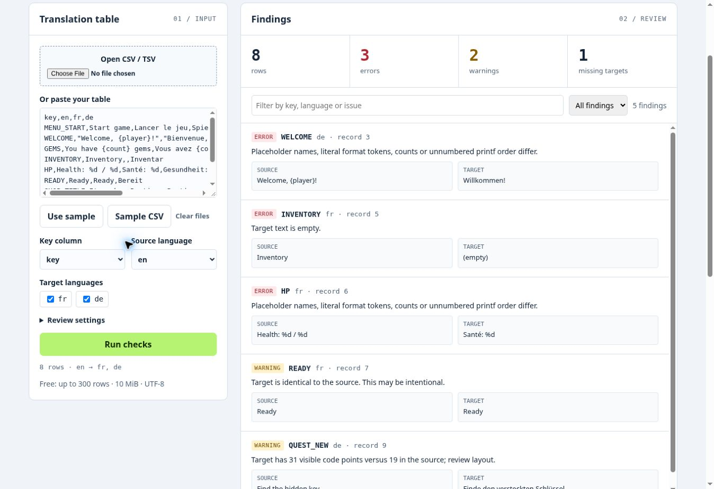

# LocaleLedger Lite — free game localisation CSV checker

Check a game's exported translation table for missing strings, duplicate keys and mismatched placeholders before release. One HTML file, processed locally, with no sign-up or dependencies.

**[Try the free checker](https://localeledger-qa.mza-als.chatgpt.site)** · **[Release checklist](https://localeledger-qa.mza-als.chatgpt.site/release-checklist.html)** · **[Get Pro — $12 USD once](https://densify6.gumroad.com/l/localeledger-pro)**



*Actual Lite interface, showing deliberately flawed synthetic data. These findings are examples, not customer results.*

## Run it offline

Download `LocaleLedger-Lite.html` and open it in a desktop Chromium browser. Open a UTF-8 CSV/TSV file or paste its contents, choose the key, source and target columns, then click **Run checks**. No installation, account or API key is required. The downloaded checker makes no network requests; its optional links open the public guide or shop only when clicked.

Use `examples/current.csv` to try the checker, or start with `examples/blank-template.csv`. Lite supports up to **300 data rows** and **10 MiB**. Comma, semicolon and tab delimiters are detected; quoted commas, doubled quotes and multiline fields are supported.

```csv
key,en,fr,de
WELCOME,"Welcome, {player}!","Bienvenue, {player}!",Willkommen!
HP,Health: %d / %d,Santé: %d,Gesundheit: %d / %d
INVENTORY,Inventory,,Inventar
```

This excerpt contains a lost `{player}` token, one missing `%d` and an empty French target. A populated cell alone does not establish release readiness.

## What Lite checks

- Missing translations, blank keys or source strings, and duplicate keys.
- Literal placeholder signatures such as `{player}`, `{0}`, `${name}` and printf tokens. Named/numbered tokens can move; unnumbered printf tokens must preserve order.
- Review warnings for recognised markup differences, identical source/target text, edge whitespace, control counts and configurable character/expansion limits.

It works on exported wide tables independently of the game engine. It does not validate engine imports, translation quality, font coverage, RTL behaviour or rendered pixel width. ICU plural/select and nested brace formats need a specialised checker; their placeholder comparison is skipped and flagged for review. Intentional source copies and length changes can produce warnings.

## When Pro is useful

| Need | Lite | Pro |
| --- | --- | --- |
| Local CSV/TSV structural checks | Up to 300 rows | Up to 25,000 rows |
| Locale-root JSON import | — | Included |
| Previous/current release comparison and possibly stale targets | — | Included |
| Export JSON/CSV issue reports | — | Included |
| +35% pseudolocalised CSV for layout testing | — | Included |
| Dependency-free Node.js CLI and internal-use source | — | Included |

[LocaleLedger Pro](https://densify6.gumroad.com/l/localeledger-pro) is **$12 USD once**, plus applicable taxes. It includes offline delivery files and a commercial-use licence for one studio/organisation. “Possibly stale” means translator review is warranted, not that a translation is definitely wrong. Pseudolocalisation does not replace engine, font or RTL testing.

## Sharing, privacy and support

Lite may be used and shared **unchanged** for personal or commercial checking. This is a freely downloadable tool with source included, under the permission in `LICENSE.txt`; it is not offered under an open-source licence. Pro and its delivery files are not part of this repository.

The checker keeps table text in tab memory and does not use analytics, cookies or browser storage. Close the tab or clear files to discard inputs. The hosted demo is served normally by its hosting provider. Never publish confidential game strings in a public issue; use a minimal synthetic CSV if reporting a problem. Paid buyers can use the contact/support route on their Gumroad receipt.

Commercial disclosure: LocaleLedger Pro is our paid product. The software and documentation were built with AI assistance. No game-engine affiliation or endorsement is claimed.
